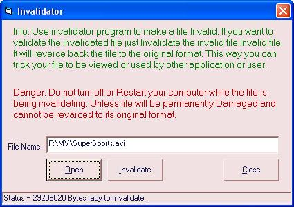



## Invalidator

### Description

If you want to make your files unusable to the other programs or users to work then you may find my Invalidator program very useful.

It is so easy as turning on and off a switch.

Though I used an easy concept to for the Reversable Invalidator, it maybe useful for a Software developers.

Open any type of file and watch its effect. :)

I Like to have your commants about my Soft tools.

Please Vote for me...
 
### More Info
 
Power felure or Restarting the computer while a file is being Invalidating will be damaged. :O Unless there is no side effects.

             |
---                |---
**Submitted On**   |2005-05-25 18:41:12
**By**             |[dsnHira](https://github.com/Planet-Source-Code/PSCIndex/blob/master/ByAuthor/dsnhira.md)
**Level**          |Intermediate
**User Rating**    |4.5 (18 globes from 4 users)
**Compatibility**  |VB 6\.0
**Category**       |[Files/ File Controls/ Input/ Output](https://github.com/Planet-Source-Code/PSCIndex/blob/master/ByCategory/files-file-controls-input-output__1-3.md)
**World**          |[Visual Basic](https://github.com/Planet-Source-Code/PSCIndex/blob/master/ByWorld/visual-basic.md)
**Archive File**   |[Invalidato1892555252005\.zip](https://github.com/Planet-Source-Code/dsnhira-invalidator__1-60696/archive/master.zip)

